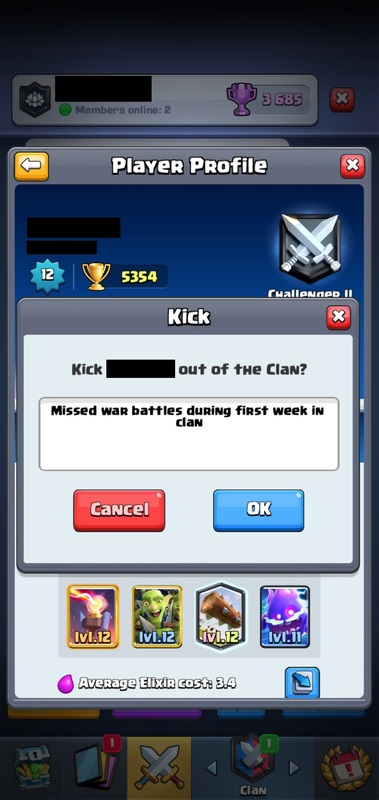
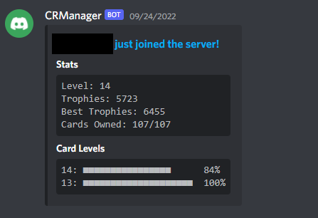
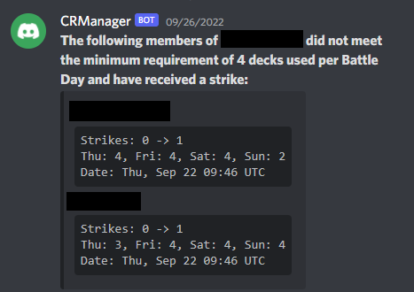

# Clash Royale Manager

Clash Royale Manager is an upgraded version of [ClashBot](https://github.com/chradajan/ClashBot). It offers newer Discord API features like slash commands and context menus, improved stat tracking, and multi-clan support on one server. This Discord bot can

- Manage server roles and nicknames based on users' in-game clan roles and usernames
- Track daily participation and win/loss statistics in River Races
- Send daily reminders to users that have not used all their River Race decks
- Assign strikes to members at the end of each River Race if they did not use a specified number of decks each day or did not achieve a minimum medals threshold
- Predict the outcome of a River Race based on each clan's historical average performance and daily deck usage

## Setup

Before using this bot, you must first create its database, provide your Discord guild's ID, and use the bot's setup commands in Discord. Start by cloning this repository with the command

```
git clone https://github.com/chradajan/ClashRoyaleManager
```

### Database

Clash Royale Manager uses a MySQL database for storing users' Clash Royale data and win/loss statistics. If you do not have MySQL server installed, follow the steps [here](https://dev.mysql.com/doc/mysql-installation-excerpt/5.7/en/) to install it. Once you have it installed, create a database and user to access it. Then, use the schema located in the root directory ([db_schema.sql](db_schema.sql)) to create all the necessary tables with this command:

```sql
mysql -u <USERNAME> -p <DATABASE NAME> < db_schema.sql
```

After the database is created, you must enter your Discord guild's ID. This can be found by going into Discord Settings > Advanced > Enable Developer Mode. Once developer mode is enabled, simply right click your Discord server and select "Copy ID". Enter this into the database with the command

```sql
mysql -u <USERNAME> -p <DATABASE NAME> -e "INSERT INTO variables VALUES (FALSE, <Guild ID>);"
```
replacing \<USERNAME>, \<DATABASE NAME>, and \<Guild ID> with their respective values.

### Discord Developer

To create the actual Discord bot, follow these steps:

1. Go to [Discord Developer Portal](https://discord.com/developers/applications).
2. Create a new application and give it a descriptive name.
3. Create a bot under your new application. This is where you can assign it a username that will be visible on Discord. Make sure to note down its token as this will be needed later.
4. Give it the "SERVER MEMBERS INTENT" and "MESSAGE CONTENT INTENT".
5. Navigate to OAuth2 > URL Generator. Under scopes, select "bot" and "applications.commands". Then, check the following permissions:

    - Manage Roles
    - Manage Nicknames
    - Send Messages
    - Attach Files
    - Manage Messages
6. Copy the generated url at the bottom of the page. This url is used to invite your bot to your server.

### Clash Royale API

All Clash Royale data gathered by Clash Royale Manager comes from the official Clash Royale API. You must provide your own API key to use this bot. Follow these steps to create an API key:

1. Go to https://developer.clashroyale.com/ and create a developer account.
2. Select "My Account" from the dropdown in the top right.
3. Create a new API key for the IP address of the server where this bot will be hosted.
4. Note down this API key as it will be needed to finish setting up the bot.

### Config

From the root directory of your cloned repository, navigate to `./ClashRoyaleManager/config/`. Create a Python file in this directory called `credentials.py`. Populate this file with the following information:

```python
# Discord bot token
BOT_TOKEN = "<Your bot's token>"

# Clash Royale API key
CLASH_API_KEY = "<Your Clash Royale API key>"

# Database information
IP = "<IP address of your MySQL server>"
USERNAME = "<Your database's username>"
PASSWORD = "<Your database's password>"
DATABASE_NAME = "<Your database's name>"
```

substituting the text enclosed in angle brackets with the relevant keys generated in the previous steps. These keys must all be enclosed in double quotes.

### Starting the Bot

Once all the steps above have been completed, your bot is ready to be launched. From the root directory, launch the bot with

```bash
cd ClashRoyaleManager/
python3 ClashRoyaleManager/__main__.py
```

## First Time Setup

The first time the bot is launched, it will provide a set of slash commands used solely for setup instead of its normal commands. All of the following commands must be used to complete setup.

### `/register_clan_role <clan_role> <discord_role>`

This command is used to tell the bot what roles to assign registered users based on their in-game role (Member, Elder, Co-leader, Leader). These roles can be purely cosmetic or be used to determine access to certain channels. They will only be assigned to users that are members of your clan(s).

### `/register_special_role <special_status> <discord_role>`

This command determines what role to assign to users when they first join the server and what role to assign to users that have registered but are not a member of your clan(s). The new role should be used to limit new members to only being able to see a rules channel until the register using the `/register` command.

### `/register_special_channel <channel_purpose> <channel>`

There are a couple of special channels used by the bot for various purposes. Those are assigned using this command. The same channel can be used for multiple purposes if desired.

| Channel | Purpose | Screenshot |
|---------|---------|------------|
| Kicks | In-game screenshots of a user being kicked from the clan can be sent here. They are automatically parsed and provide and easy way to log that a member was kicked. |  |
| NewMemberInfo | Messages with a quick preview of a user's stats and card levels are sent to this channel upon a new user using the `/register` command. |  |
| Rules | Messages sent here are automatically deleted by the bot. This is intended to be the only channel that users have access to upon joining the server. |  |
| Strikes | If automated strikes are enabled, a message will be sent to this channel each Monday with a list of users that did not meet the minimum war requirements. |  |

### `/register_primary_clan <tag> <role> <channel> <track_stats> <send_reminders> <assign_strikes> <strike_type> <strike_threshold>`

This is the command used to specify which clan(s) the bot should track. Members of the clans designated with this command will receive a Discord role corresponding to their role within the clan, as well as a role associated with the clan, upon registering on Discord with `/register`. At least one primary clan must be provided, but you can designate as many additional clans as you'd like.

| Parameter | Explanation |
|-----------|-------------|
| tag | The tag of the clan you want to be made a primary clan. |
| role | The Discord role to assign to registered members of this clan. |
| channel | The Discord channel where reminders are sent to members of this clan that have not used all of their war decks. |
| track_stats | Whether River Race win/loss statistics should be tracked for this clan. |
| send_reminders | Whether automated reminders should be sent to members of this clan. |
| assign_strikes | Whether automated strikes should be given to members of this clan at the end of a River Race. |
| strike_type | If `Decks` is selected, then members must use a specified number of decks per day each River Race. If `Medals` is selected, then they must acquire a specified number of medals each River Race in order to not receive a strike. |
| strike_threshold | How many decks must be used or how many medals must be acquired to avoid receiving an automated strike. |

## Finishing Setup

After using all the setup commands listed above providing all the necessary information, finish the first time setup by using the `/finish_setup <season>` command where `<season>` is the integer value of the current Clash Royale season. If any required information is missing, the bot will notify you. Otherwise, it will tell you to restart the bot. After restarting, the setup commands will no longer be available. You can now access all of the bots normal commands. It's recommended at this point to shut down the bot again, go into your Discord server's settings, navigate to Integrations, and choose your bot. From this page, you should choose who has access to which commands. Once permissions are set up how you'd like, the bot can be turned back on.

## Automated Routines

Clash Royale Manager runs several automated routines at set periods.
### Role Management

Every 8 hours, Clash Royale Manager makes any necessary adjustments to users' roles and nicknames. For example, if a user left one of the primary clans, their in-game and clan affiliation roles will be removed, and they will be given the visitor role. If a former visitor joined your clan, they'll receive the appropriate clan roles. If a user was promoted or demoted, their in-game role will be adjusted. If they changed their Clash Royale username, their Discord nickname will be updated to reflect that.

### Stat Tracking

Every hour on River Race days, Clash Royale Manager checks the battle logs of users in primary clans with stat tracking enabled and logs their wins and losses in each River Race game mode.

### Strikes

In addition to being manually assigned, strikes can be automatically given to players that do not meet a clan's minimum requirements for River Races. Whether that's based on daily deck usage or medals earned, these automated strikes are given Monday mornings after the completion of a River Race.

## Commands

This bot adds a significant number of slash commands. For a full list, simply type `/` on Discord and select the bot. Below are a couple of useful commands added by Clash Royale Manager.

### `/register `

Used by users when they first join your Discord server, this command links a Discord user to their Clash Royale account using their player tag. Upon successfully registering, the user will lose the role they received upon joining the server and gain the appropriate clan based roles.
### `/set_automation_status` and `/set_participation_requirements`

These commands can be used to adjust which automated features are enabled for each clan and what each clan's requirements are to avoid receiving automated strikes.

### `/give_strike` and `/remove_strike`

Commands used for manually giving and removing strikes.

### `/export`

This is primarily how all the data gathered by Clash Royale Manager is viewed. This command is used to export relevant information from the database to an Excel spreadsheet.

### `/decks_report`, `/medals_report`, `/predict`, and `/river_race_status`

This set of commands are used to view current information about a clan's River Race. They can be used to view a detailed breakdown of how many decks your clan has left to use today, who in your clan hasn't been earning enough medals, how the final standings are predicted to look, and how many decks each clan has left to use today.
